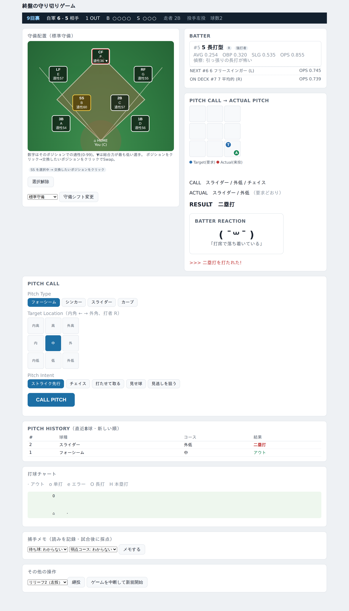
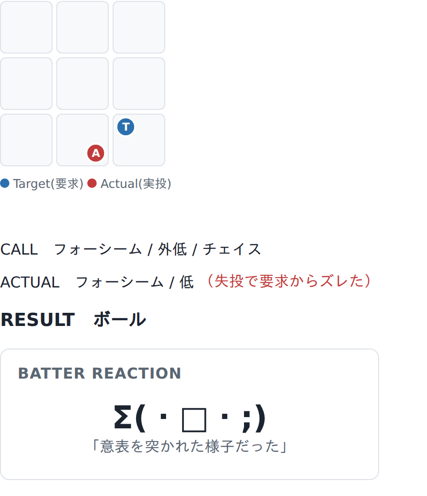
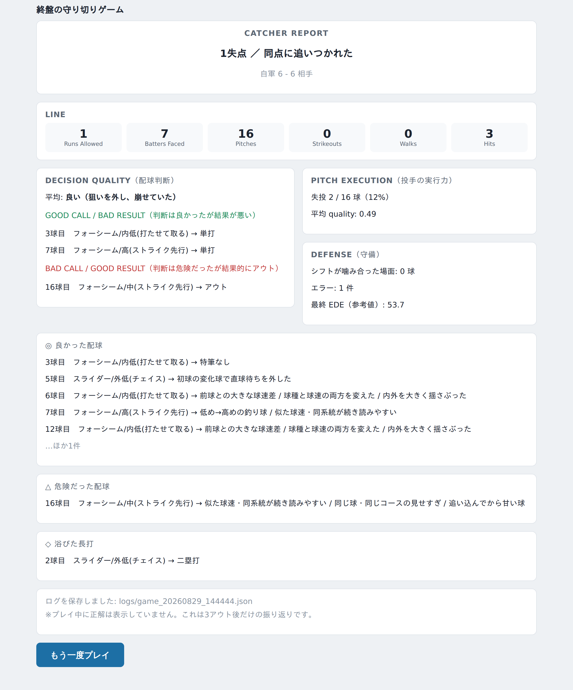

# Pitch Call Simulator（配球判断シミュレーター）

[](https://github.com/tsukinukeeeru2/pitch-calling-simulator/actions/workflows/tests.yml)

野球の**捕手の「1球ごとの状況判断」**をゲームにした、Python 製の1人用シミュレーターです。
CLI 版（`main.py`）と、ブラウザで遊べる Web 版（`webapp.py`）があります。**外部ライブラリは使っていません**（Python の標準ライブラリのみ）。

---

## 作品概要

毎回ちがう**終盤の1場面**（7〜9回・延長、点差、走者、相手打順）から始まり、
その半イニングで **3アウトを取るまで**が1ゲームです（相手が裏の攻撃でサヨナラの勝ち越し点を取ったらそこで終了）。

プレイヤーは捕手として、毎球

- **球種** ／ **狙うコース（3×3グリッド）** ／ **配球意図**（ストライク先行・チェイス・打たせて取る・見せ球・見逃し狙い・ピッチアウト）

を選びます。ただし結果は捕手だけでは決まりません。投手のコントロール（失投）・球威・打者の能力と狙い・守備・乱数がすべて絡むので、**「良い配球＝抑える確率が上がる」だけ**です。

そして **プレイ中に正解は表示されません**。打者の表情（顔文字）、配球履歴、打者の左右／OPS、守備力から自分で読みます。
結果と判断を分けた振り返りは **3アウト後だけ** 見られます。



*スコアボード・球場図（クリック→クリックで守備交換）・打者カード・配球コール・配球履歴を1画面に。*



*要求した場所（Target）と実際の投球（Actual）をストライクゾーン図に別マーカーで表示。「良い配球を要求したのに投手が失投した」が一目で分かる。*



*3アウト後だけ表示される試合後の分析。GOOD CALL / BAD RESULT（不運）と BAD CALL / GOOD RESULT（幸運）を区別する。*

---

## 制作理由

小学生から大学まで10年間野球を続け、その大半を**捕手**としてプレーしてきました。
捕手は1球ごとに、打者の表情を横目で見て、走者の気配を感じて、頭の中で次の球種とコースを組み立て、投手に返球してリズムを作る——という判断を同時にこなします。この「**不完全な情報のまま、身体感覚で決める**」感覚を、大学で学び始めた Python で自分の手でゲームとして形にしたいと思ったのが出発点です。

だから、このゲームは「一番勝率の高いボタンを押す」作りにはしていません。
**正解を伏せたまま、自分の読みで意思決定する**——実際の捕手がやっていることをそのまま操作にすることを狙いました。

---

## ゲームの遊び方

### Web版（おすすめ）

```bash
python webapp.py
```

ブラウザで `http://127.0.0.1:8765` を開きます。

1. `START GAME` → 場面紹介 → `PLAY BALL`
2. 最初に操作チュートリアル（6種類のリズム入力を1回ずつ成功させる。`スキップ`も可）
3. メイン画面で **球種・コース・配球意図**を選んで `CALL PITCH`
4. 場面に応じてリズム入力（受球＝フレーミング／盗塁の送球／ブロッキング／振り逃げ／サイン交換／バント処理）
5. 3アウトで **CATCHER REPORT**（試合後の分析）

### CLI版

```bash
python main.py
```

`Enter`＝投球へ ／ `d`＝守備変更 ／ `m`＝打者の読みをメモ ／ `w`＝敬遠 ／ `p`＝継投 ／ `q`＝終了。

---

## 主な機能

| 機能 | 説明 |
|---|---|
| **配球の選択** | 球種 × 3×3コース × 配球意図6種。隅を狙うほど失投で真ん中に入りやすい |
| **打者の反応** | 顔文字＋短文。約15%は逆の印象を与える「ミスリード」、25%は情報の薄い反応。**顔文字だけで内部状態は特定できない** |
| **セットアップ（前球が次を活かす）** | 「低め見せた次の高め速球」など、条件が揃ったときだけ小さく（合計±0.15に制限）効く |
| **試合後の分析** | 「判断は良かったが結果が悪い（不運）」「判断は悪いが結果に救われた（幸運）」を区別して表示 |
| **捕手のリズム入力** | 送球・ブロッキング・振り逃げ・サイン交換・バント処理・受球・返球。**結果は確定させず確率を±に少しずらすだけ** |
| **守備** | 球場図で7人の配置を可視化。クリック→クリックで選手交換、7種類の守備シフト |
| **相手の小技** | 犠打（構えは見える）・エンドラン（見えない）。ピッチアウトで対抗 |
| **走塁** | 単打での進塁・長打・併殺・犠飛・進塁打・盗塁・振り逃げ・エラー進塁 |
| **投手の疲労** | 球数がかさむほど失投率が上がり球威が落ちる。継投で持ち球はリセット |
| **実データ差し替え口** | `--lineup team.json` で相手打線を差し替え。`--mlb-demo` で実在選手のサンプル打線 |
| **再現可能** | `--seed N` で場面生成・投球判定を固定。CLIとWebで同じ結果になる |
| **BGM（Web版）** | Web Audio API で合成した自作曲（トランペット＋太鼓）。右上のボタンで ON/OFF |

---

## 使用技術

- **Python 3**（標準ライブラリのみ、外部依存ゼロ）
- **CLI版**：`argparse`、テキスト描画、`ansi.py` で端末カラー（パイプ時は自動オフ）
- **Web版**：`http.server`（標準ライブラリ）で HTTP サーバを自作。画面は基本 HTML フォーム、
  タイミングが必要なリズム入力の部分だけ最小限の JavaScript（JS 無効でもボタン送信で進める）。
  BGM は Web Audio API のオシレーターで合成
- **テスト**：`unittest` で 153 件（最後に 1000 ゲームのストレステスト）。GitHub Actions で CI
- **乱数**：`random.Random(seed)` を engine が最初から最後まで受け取る形にして再現性を確保

---

## 自分が工夫したポイント

1. **判定ロジックを1箇所に集約した**
   `engine.resolve_one_pitch()` が「1球を判定して状態を進める」唯一の入口。
   CLI（`main.py`）も Web（`webapp.py`）もこの関数を呼ぶだけで、**判定ロジックを二重に書いていない**。違うのは表示だけ（CLI は `print()`、Web はメッセージのリストを HTML 化）。

2. **「正解を出さない」設計を最後まで守った**
   打者の弱点や狙い球を後から評価する内部指標（`catcher_decision_quality`、-1〜+1）は持っていますが、
   **プレイ中は絶対に画面に出しません**（テストで担保）。表示するのは3アウト後だけです。

3. **リズム入力は結果を確定させない**
   送球やブロッキングなどのミニゲームは、成功確率を ±0.25 の範囲で少しずらすだけ。
   上手くても抜けるし、下手でも刺せる——実際の野球と同じにしました。

4. **同じリズム処理を CLI と Web で共有した**（後述の「一番苦労した点」）

5. **外部データへの差し替えを想定して層を分けた**
   球種は `pitch_data.py` に1エントリ足すだけ。相手打線は JSON/CSV で差し替え。
   実在選手データは `mlb_data_adapter.py`（Adapter パターン）を通すので、API の形式が変わっても直すのはそのファイルだけ。

---

## プロジェクト構成

```
engine.py          1球を判定して状態を進める唯一の入口（CLI/Web 共通）
match_state.py     MatchState（試合状況）＋ 終盤の場面をランダム生成
judge.py           1球の判定チェーン（実投球→狙い→セットアップ→タイミング→打球）
strategy.py        配球意図・セットアップ・判断の質・試合後分析
pitcher.py         Pitcher と execute_pitch（要求→実際の投球。失投でコースがズレる）
batter.py          Batter（公開: 左右/OPS/タイプ ／ 隠し: 苦手球種・狙い球のクセ）
lineup.py          相手打線9人・打順の回転・JSON/CSV 読み込み
pitch_data.py      球種のデータ（1行足すと球種が増える）
pitch_history.py   配球履歴の記録と照会
batted_ball.py     フェア打球の中身（方向/種類/強さ/飛距離）を確率生成
baserunning.py     フェア打球後の走塁を解決
fielders.py        Fielder ＋ position_fit（ポジションで守備力が変わる）
defense.py         7人の配置・守備シフト
fielding.py        打球＋配置 → アウト/ヒット
reaction.py        打者の反応（顔文字＋短文＋カテゴリ）
opponent.py        相手ベンチの作戦（犠打・エンドラン）
qte.py             捕手のリズム／QTE ミニゲーム
constants.py       コース・確率など共通データ

main.py            CLI 版の進行役
webapp.py          Web 版（http.server のみ）
ui.py / ballpark_view.py / ansi.py   CLI の表示

mlb_data_adapter.py   実在選手データ → Batter の Adapter
stats.py              logs/ を横断集計する成績ダッシュボード
replay.py             1ゲームを名場面だけ振り返るリプレイ

tests.py              自動テスト 153 件
lineups/ mlb_data/    差し替え用サンプルデータ
```

### アーキテクチャ

```
        Game Engine (engine.py → judge.py 以下)
             ↑                    ↑
          main.py              webapp.py
          (CLI版)              (Web版)
```

`engine.py` は `print()` も `input()` もしません。表示層（CLI か Web か）が、
engine の返す `(結果, メッセージのリスト)` をそれぞれのやり方で見せるだけです。

---

## 起動方法

必要なもの：**Python 3.10 以上のみ**（`pip install` は不要）。

```bash
git clone https://github.com/tsukinukeeeru2/pitch-calling-simulator.git
cd pitch-calling-simulator

python webapp.py            # Web版（推奨）。ブラウザで http://127.0.0.1:8765
python main.py              # CLI版

python webapp.py --seed 42        # 場面・判定を再現可能にする
python webapp.py --mlb-demo       # 実在選手のサンプル打線で遊ぶ
python main.py --lineup lineups/sample_team.json   # 相手打線を差し替え

python tests.py            # 自動テスト（最後に1000ゲームのストレステスト）
python stats.py           # logs/ を集計した成績ダッシュボード
python replay.py          # 直近のゲームを名場面だけリプレイ
```

`--difficulty beginner`（ヒント増）／ `--difficulty expert`（打球チャートを隠す）で難易度も選べます（既定 `normal`）。

---

## 今後改善したい点

- **`webapp.py` の分割**：現状1ファイルに約2,000行。画面パーツごとにモジュールを分けたい
- **自軍の攻撃（打撃）**：いまは1半イニングで完結する割り切り。攻守を通した1試合にしたい
- **走塁の精度**：本塁での憤死・中継プレー・タッチアップの細かい判定は未実装
- **スマホ UI**：「崩れない」レベルまで。タップ領域の拡大などモバイル最適化はこれから
- **実データの取り込み**：Baseball Savant のゾーン別成績を、左右変換の検証込みで自動取得できるようにしたい
- **テストの整理**：`tests.py` が1ファイルで大きいので、対象モジュールごとに分割したい

---

## 開発について

設計・仕様・野球ドメインの判断は自分で行い、実装は AI コーディングアシスタント（Claude）と
ペアプログラミングする形で進めました。コードは全体を自分で読み、説明できる状態にしています。
